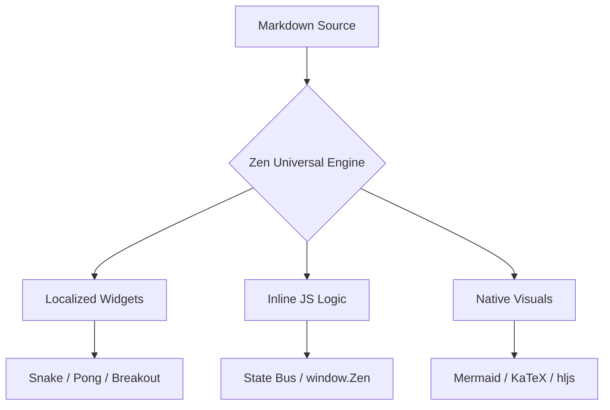

# 🌌 ZEN UNIVERSAL ENGINE – THE ULTIMATE SHOWDOWN

Welcome to the **Future of Content**. This profile push the limits of the **Zen Universal Engine** – a full web environment localized and perfected.

---

## 📊 SYSTEM ARCHITECTURE

---

## 🧮 QUANTUM CALCULATIONS

The engine now natively supports complex mathematical notation via **KaTeX**:

$$
I = \int_{0}^{\infty} e^{-x^2} dx = \frac{\sqrt{\pi}}{2}
$$

And the **Schrödinger Equation**:

$$
i\hbar\frac{\partial}{\centerdot\partial t}\Psi(\mathbf{r},t) = \left [ \frac{-\hbar^2}{2m}\nabla^2 + V(\mathbf{r},t)\right ] \Psi(\mathbf{r},t)
$$

---

## 🎮 THE ARCADE (LOCALIZED POWER)

### Flappy Zen

### Zen Breakout

---

## 🌐 LIVE NODE DATA

### Global Network Status

### Node Identifier (Dog Fetcher)

---

## 🕹️ INTERACTIVE BUS (window.Zen)

Clicking this button will trigger a **Global OS Notification** across the entire application layer.

<button onclick="Zen.notify('SYSTEM OVERRIDE INITIATED! ⚡')" style="background: linear-gradient(135deg, #4f46e5, #9333ea); color: white; padding: 20px 50px; border-radius: 24px; border: none; font-black uppercase tracking-widest text-xs cursor: pointer; box-shadow: 0 20px 40px rgba(79,70,229,0.4);">
  TRIGGER GLOBAL NOTIFY
</button>

---

**🚀 STATUS: OMNIPOTENT. STABILITY: 100%. ENGINE: GOATED. 🚀**
